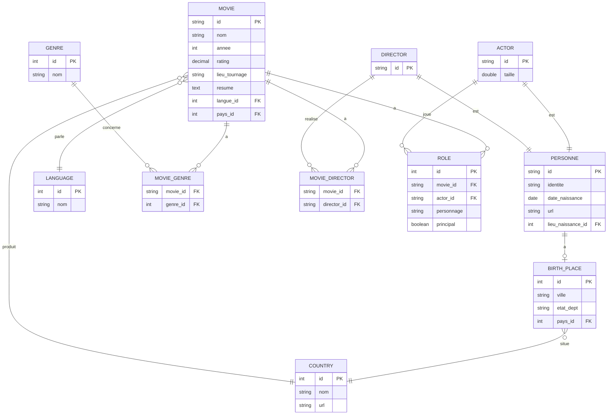

# Modèle Physique de Données (MPD)

Représentation visuelle du schéma de base de données du projet Movies : tables, colonnes, clés primaires/étrangères et relations entre les entités.
Fait sur Mermaid. 

